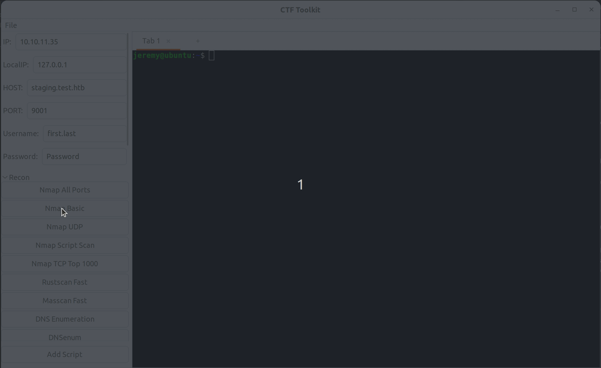

# CTF ScriptRunner

🚀 **A powerful GTK-based terminal application designed for Capture The Flag (CTF) competitions and penetration testing workflows.**



## 📋 Overview

CTF ScriptRunner is a comprehensive toolkit that streamlines your penetration testing and CTF workflow by providing quick access to commonly used commands and scripts. Built with Python and GTK, it features an intuitive interface with organized script categories, customizable variables, and advanced functionality like long-press support for tablet users.

## ✨ Key Features

### 🎯 **Comprehensive Script Library**
- **70+ pre-configured CTF scripts** covering the entire attack lifecycle
- **9 organized categories**: Recon, Web, LinuxPrivEsc, WinPrivEsc, SMB, Listeners, Payloads, Crypto, BruteForce
- **Modern tools integration**: Nmap, Rustscan, Gobuster, LinPEAS, WinPEAS, Hydra, and more

### 🖥️ **Advanced Terminal Interface**
- **Multi-tab terminal support** with closeable tabs
- **Right-click context menus** for enhanced functionality
- **Tablet-friendly long-press support** (500ms hold) for touch devices
- **Visual feedback** with CSS styling and animations

### ⚙️ **Smart Variable System**
- **Dynamic variable substitution** (`<$IP>`, `<$HOST>`, `<$Username>`, etc.)
- **Persistent variable storage** across sessions
- **Easy variable editing** through the GUI interface

### 📁 **Script Management**
- **Add custom scripts** through intuitive dialog boxes
- **Import/Export functionality** for sharing script collections
- **Run in current tab** or **create new tab** for parallel operations
- **Template-based command execution** with variable replacement

## 🛠️ Installation & Setup

### Prerequisites
```bash
# Install required packages on Kali Linux
sudo apt update
sudo apt install python3 python3-gi gir1.2-gtk-3.0 gir1.2-vte-2.91

# Optional: Install common CTF tools
sudo apt install nmap gobuster nikto hydra john hashcat sqlmap
```

### Quick Start
```bash
# Clone the repository
git clone https://github.com/yourusername/ScriptRunner.git
cd ScriptRunner

# Run the application
python3 pyterminal.py
```

## 📚 Script Categories

### 🔍 **Reconnaissance**
- **Network Discovery**: Nmap variants, Rustscan, Masscan
- **DNS Enumeration**: dig, dnsenum, subdomain discovery
- **Service Detection**: Port scanning, version detection, vulnerability scripts

### 🌐 **Web Application Testing**
- **Directory Discovery**: Gobuster, ffuf, dirb
- **Vulnerability Scanning**: Nikto, SQLMap, whatweb
- **Subdomain Enumeration**: DNS brute-forcing, virtual host discovery

### 🐧 **Linux Privilege Escalation**
- **Automated Tools**: LinPEAS, LinEnum, Linux Smart Enumeration
- **Manual Enumeration**: SUID/SGID files, capabilities, cron jobs
- **System Analysis**: Process monitoring, network connections

### 🪟 **Windows Privilege Escalation**
- **PowerShell Tools**: WinPEAS, PowerUp
- **System Information**: whoami, systeminfo, installed software
- **Network Analysis**: ipconfig, network configuration

### 🔧 **Exploitation & Payloads**
- **Reverse Shells**: Bash, Python, PHP, PowerShell variants
- **MSFVenom Payloads**: Linux, Windows, PHP payload generation
- **Listeners**: Netcat, HTTP servers, SMB shares

### 🔐 **Cryptography & Encoding**
- **Encoding/Decoding**: Base64, URL encoding, ROT13
- **Hash Functions**: MD5, SHA256 generation
- **Password Cracking**: John the Ripper, Hashcat integration

## 🎮 Usage Examples

### Basic Workflow
1. **Set Variables**: Update IP, HOST, Username, Password in the left panel
2. **Choose Category**: Expand the desired script category (e.g., "Recon")
3. **Run Scripts**: 
   - **Single click**: Run in current tab
   - **Long press** (500ms): Choose "Run in Current Tab" or "Run in New Tab"

### Advanced Features
- **Custom Scripts**: Click "Add Script" to create your own commands
- **Import/Export**: Share script collections via JSON files
- **Multi-tasking**: Use "Run in New Tab" for parallel operations
- **Tablet Support**: Long-press any script button for context menu

## 🖱️ Tablet & Touch Support

CTF ScriptRunner includes comprehensive tablet support:
- **Long-press detection**: Hold any script button for 500ms
- **Visual feedback**: Buttons briefly highlight green when long-press is detected
- **Context menus**: Access "Run in Current Tab" / "Run in New Tab" options
- **Terminal long-press**: Access Copy/Paste/Close Tab options in terminals

## 📁 File Structure

```
ScriptRunner/
├── pyterminal.py          # Main application
├── ctf_templates.json     # Script definitions
├── ctf_variables.json     # User variables
├── peekvideo.gif         # Demo video
└── README.md             # This file
```

## 🔧 Configuration

### Adding Custom Variables
Edit `ctf_variables.json` or use the GUI:
```json
{
  "IP": "10.10.11.35",
  "HOST": "target.htb",
  "LocalIP": "10.10.14.15",
  "Username": "admin",
  "Password": "password123"
}
```

### Adding Custom Scripts
Use the "Add Script" button or manually edit `ctf_templates.json`:
```json
{
  "label": "Custom Nmap",
  "command": "nmap -sC -sV <$IP>",
  "category": "Custom"
}
```

## 🚀 Advanced Tips

### Keyboard Shortcuts
- **Ctrl+Shift+C**: Copy in terminal
- **Ctrl+Shift+V**: Paste in terminal  
- **Ctrl+W**: Close current tab

### Efficient CTF Workflow
1. **Recon Phase**: Start with "Nmap All Ports" → "Nmap Basic"
2. **Web Testing**: Use "Gobuster Dir" → "Nikto" → "SQLMap"
3. **Exploitation**: Set up "Netcat Listener" → Generate payloads
4. **Privilege Escalation**: Run "LinPEAS" or "WinPEAS" → Manual enumeration

## 🤝 Contributing

Contributions are welcome! Please feel free to submit pull requests with:
- New script templates
- Bug fixes
- Feature enhancements
- Documentation improvements

## 📜 License

This project is licensed under the MIT License - see the LICENSE file for details.

## 🔗 Acknowledgments

- **SecLists** - Comprehensive wordlists for discovery
- **PEASS-ng** - Privilege escalation enumeration suite
- **GTK** - Cross-platform GUI toolkit
- **VTE** - Virtual Terminal Emulator widget

## 📞 Support

For issues, feature requests, or questions:
- Open an issue on GitHub
- Check existing documentation
- Review the demo GIF for usage examples

---

**Made with ❤️ for the CTF and penetration testing community**